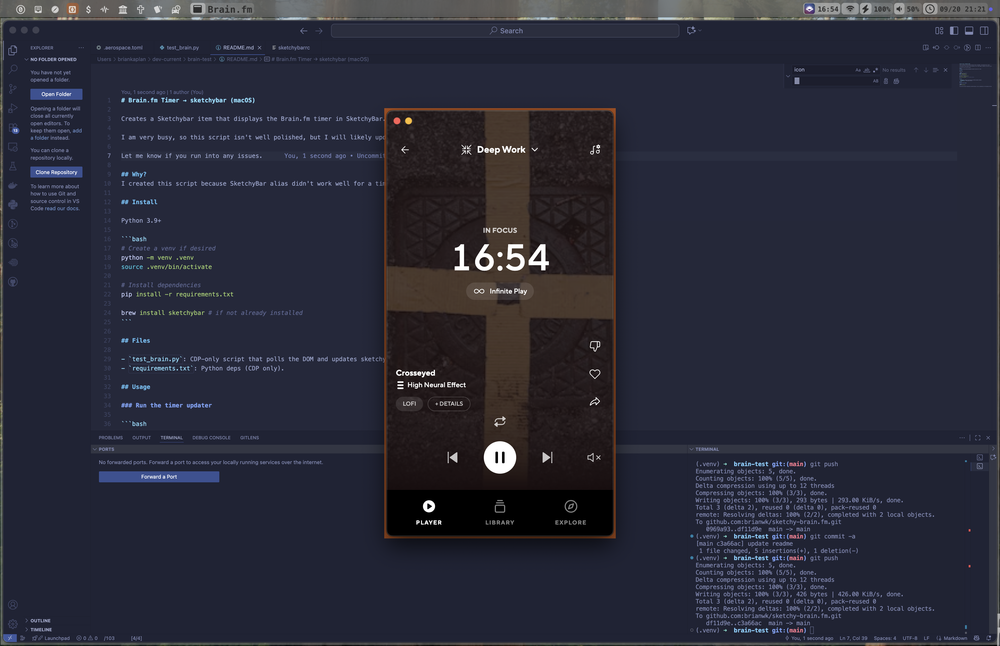

# Brain.fm Timer → sketchybar (macOS)

Creates a Sketchybar item that displays the Brain.fm timer in SketchyBar. I hope someone finds it useful. 

I am very busy, so this script isn't well polished, but I will likely update it sometime in the future to be more polished. For example, this is more dependent on my unique setup so you will likely have to fork this script and modify it to get the intended result. 

Let me know if you run into any issues.



## Why?
I created this script because SketchyBar alias didn't work well for a timer.

## Install

Python 3.9+

```bash
# Create a venv if desired
python -m venv .venv
source .venv/bin/activate

# Install dependencies
pip install -r requirements.txt

brew install sketchybar # if not already installed
```

## Files

- `test_brain.py`: CDP-only script that polls the DOM and updates sketchybar.
- `requirements.txt`: Python deps (CDP only).

## Usage

### Run the timer updater

```bash
python test_brain.py
```

You must have the Brain.fm application installed obviously. This will automatically run the program with the DevTools running on port 9222. 
